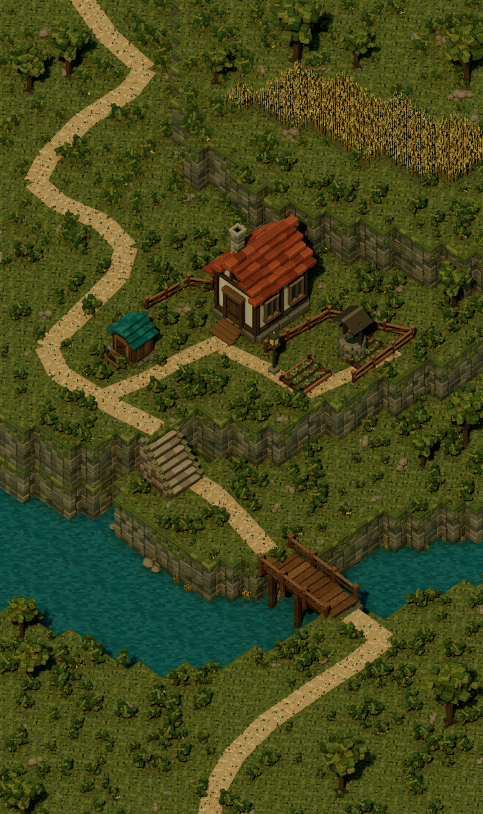

# Asset detail update

The subsequent [surface update](../Surfaces/review.md) contains the current scene render. This page preserves the preceding five-asset revision.

The saved `/Game/Terrarium/Maps/HomesteadFidelity` scene now uses second-pass shed, bridge, wheat, garden-bed and stair meshes. This update preserves the scene's existing placement transforms, camera and lighting. Exact reference parity remains unachieved.

[Reference / before / current comparison](comparison.png) · [Measured image error](comparison-metrics.json) · [Saved and reopened editor validation](../editor-validation.json)

## Changes

- Shed: stepped teal roof tiles, timber seams, hatch framing and hardware, uneven stone footing, a front trough and a matte weathered surface.
- Bridge: eleven broad planks with grain and pegs, rail posts and cross-braced support piles. The pile bounds extend to world Z -41.8 below the water surface at Z 0.
- Wheat: taller stems, branching leaves and eight modeled kernels per head. All forty saved patch transforms were retained; the earlier foliage type was preserved.
- Garden: fuller layered leaves, red produce, soil details, timber grain and reinforced corners in both beds.
- Stairs: three separate worn stones across each tread, individual side masonry courses and moss at the joints.

Every revised mesh is an original Geometry Script model at refinement pass 2. Each passed closed-component, positive-volume and saved-normal checks, followed by six-angle Lit inspection. Materials are single-sided; weathering affects base color without altering normals.

The map was saved and reloaded after integration. Validation counted 6,037 placements across 19 mesh assets and confirmed Lumen GI/reflections, virtual shadows, manual exposure and the valid cached-lighting exposure range. The final editor snapshot showed HomesteadFidelity, Lit and All Saved. The native screenshot is 1443 × 2427.

## Comparison limits

At reference resolution, full-frame RGB mean absolute error changed from 28.668 to 28.553 on the 0–255 scale. The shed region changed from 29.627 to 27.109; bridge from 26.193 to 23.479; garden from 30.075 to 29.701. Wheat changed from 27.760 to 28.162 and stairs from 31.599 to 33.967, so this update does not improve every region's pixel measurement. Added geometric detail is not proof of closer pixel correspondence.

The reference's terrain contours, vegetation distribution, cottage silhouette, softer path edges and painterly surfaces still differ visibly. Characters and the inset remain outside the original static environment scope. Full-frame metrics include those pixels. No image warping or registration was used.

This was an individual-asset detail update; the recorded broad composition pass count remains five. The goal remains active and has not been marked complete.
