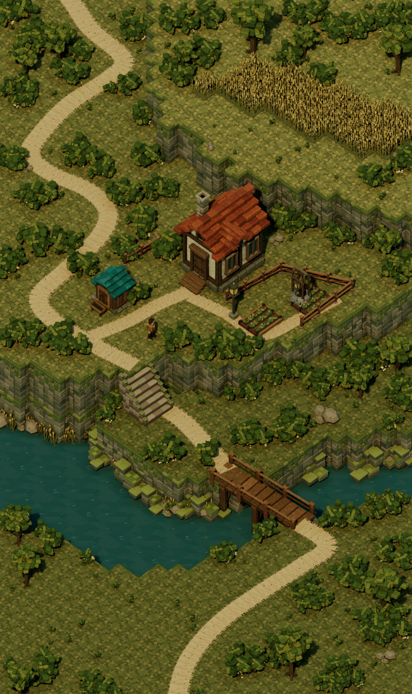

# Composition revision after the iteration limits were lifted

The user authorized further work with “lift any caps and restrictions.” The former asset and whole-scene iteration limits no longer apply; the authorization is recorded in [iteration-authorization.json](../iteration-authorization.json).

[Reference / before / current comparison](comparison.png) · [Pixel measurements](comparison-metrics.json) · [Editor validation](../editor-validation.json) · [Landmark validation](landmark-validation.json)

## Changes in the saved scene

- The cottage has a projecting side gable, additional stepped roof tiles, worn plaster patches and a matte mottled surface. This is the fourth cottage refinement.
- An original static traveler now stands at the reference path location. It is a decorative mesh with no controller, animation or gameplay systems.
- The ground uses irregular, nearly flush moss patches with color variation by elevation. Upper terrain is warmer; lower ground is more muted.
- Vegetation is grouped around reference plant-cluster centers, with a clear area around the traveler, smaller connecting plants, flowers and additional river reeds.
- The traced path curves are smoothed. The bridge is longer and narrower, with scale (0.9, 1.4, 1) and yaw -4 degrees. Its support piles reach world Z -18 below the river surface at Z 0.
- Fifty-four original stepped stone outcrops break up the lower bank silhouette. River material changes are scoped to the current level's water components.
- The final sun direction keeps both visible cottage walls lit. An initial sun-direction experiment was rejected because it over-shadowed the cottage and wheat. Final settings are recorded in [lighting.json](lighting.json), with surface multipliers in [material-calibration.json](material-calibration.json).

The previous scene is preserved at `/Game/Terrarium/Maps/HomesteadBeforePass6`. The current scene remains `/Game/Terrarium/Maps/HomesteadFidelity`.

## Validation and limitations

The map was saved and reopened in UE 5.8.2. It contains 6,022 placements across 21 mesh assets. Every active mesh has zero saved-normal errors. The new cottage, traveler, ground and bank-outcrop meshes were inspected from six Lit angles; the final ground material was recaptured after calibration. The river tint was checked in the final scene. Materials remain lit, single-sided and matte, with no normal mapping. Lumen GI/reflections, virtual shadows, manual exposure and the valid lighting-cache exposure range were verified. The editor reports no dirty map or content packages after the material saves.

The native render is 1443 × 2427. Exact pixel parity is still false. Full-image RGB mean absolute error is 29.004 versus 27.814 before this pass. The change adds missing forms and composition detail, but does not improve overall pixel correspondence. It should not be described as a percentage of fidelity or an across-the-board improvement.

Visible remaining differences include the precise terrain outlines, cliff stone proportions and weathering, vegetation silhouettes, the slate boulder, the distribution of color and light, the detailed cottage roof shape, water highlights and the lower-left inset. The static traveler is now included, while the inset is still absent. The scene is still a native 3D environment; no image warp or replacement render was used.
