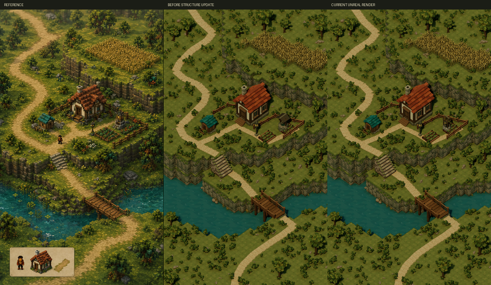

# Garden structure refinement and cliff review

The user subsequently lifted the iteration limits. The [next composition revision](../Pass6/review.md) contains the current scene; the constraints and results below are historical.

The current saved scene keeps the new open timber garden structure and the preceding cliff mesh. Exact pixel parity remains unachieved.

[Native render](structure-update.png) · [Pixel metrics](comparison-metrics.json) · [Editor validation](../editor-validation.json) · [Refinement ledger](../refinement-ledger.json)

`SM_GardenWell_v2` replaces the solid roof with an open timber frame, a windlass, rope, hanging lamp and lower stone ring. The original scene transform is retained. It is at asset pass 2 and passed closed geometry, saved-normal checks and six-angle Lit review.

`SM_CliffColumn_v3` tested larger stone courses. It passed geometry and lighting checks, but the full-scene comparison showed overly clean, block-like walls. The candidate was rejected and all 512 original `SM_CliffColumn_v2` instances were restored with exactly equal transforms. The rejected native render and its measurements remain as `rejected-cliff-v3.png` and `rejected-cliff-v3-metrics.json`. The rejected attempt still consumes the cliff's third artistic pass.

After restoring the cliff mesh, the map was saved and reopened. Validation confirmed 6,037 placements, 19 active mesh assets, zero saved-normal errors, single-sided materials, Lumen GI/reflections and fixed exposure. Full-image RGB error is 27.814 versus 27.806 before this turn; the garden-frame shape correction does not constitute a measured pixel-error improvement.

## Work requiring the iteration limits to be revised

The original objective limits each asset to three refinements and the composition to five broad passes. Cottage, cliff, ground, path and water have now used all three asset passes; the composition has used five. The ledger counts rejected versions and does not reset passes when an earlier version is restored.

The highest-impact remaining work is a coordinated composition revision: match the plateau and shoreline silhouettes, replace uniform shrub scatter with reference-positioned clusters, reshape the cottage roof outline and projections, and match the broader light and color relationships. Continuing to add detail to peripheral assets cannot establish the requested whole-image parity. This work needs the original iteration limits lifted or extended.

The character and inset pixels also remain outside the original static environment deliverable. Their omission prevents literal equality across the complete reference frame. The current environment is a native 3D render, not a generated replacement image or image-warped approximation. Completion is not claimed.
