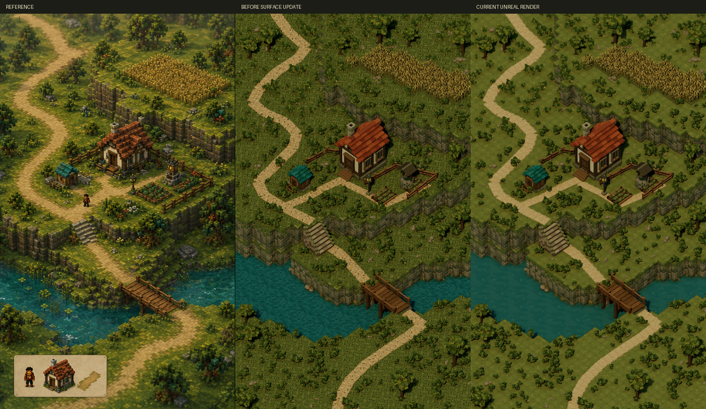

# Ground, water and path surface update

The subsequent [garden structure review](../Structures/review.md) contains the current render. This page preserves the preceding surface update.

The current `/Game/Terrarium/Maps/HomesteadFidelity` scene uses broader moss plates, quieter teal water and a flush earth path. This update addresses the previous render's excessive fine surface noise. Exact pixel parity remains unachieved.

[Native 1443 × 2427 render](surface-update.png) · [Pixel metrics](comparison-metrics.json) · [Editor validation](../editor-validation.json)

## Geometry changes

- `SM_MeadowTile_v3`: nine broad, shallow moss plates and sparse tufts replace seventy-two small raised fragments and ten tufts. The same 3,718 instance transforms were retained.
- `SM_WaterTile_v3`: fifty broader teal facets replace 288 smaller triangles, with sparse pale glints. All 190 transforms were retained.
- `SM_PathTile_v3`: flush irregular earth patches and broken verge fragments replace the original small raised facets. All 124 transforms were retained. The second path pass was rejected in the scene because raised rows read as paving boards; the third pass removes that effect.

All three active surface assets are at their third refinement pass. The preceding meshes remain available. Camera, light settings, terrain boundaries and vegetation placement were preserved. The broad composition pass count remains five.

## Verified evidence

Each surface mesh passed closed-component, positive-volume, outward-winding and saved-normal checks, then six-angle Lit inspection. The revised meshes were installed through the connected Terrarium editor. Ground and water transform comparisons were exactly equal; the path's maximum quaternion-component deviation was approximately 3.3e-16.

The map was saved, reopened and validated with 6,037 placements across 19 mesh assets. All saved-normal error counts are zero. Lumen GI/reflections, virtual shadows, fixed exposure and its cached-lighting range were confirmed. The final native editor capture was inspected against the reference.

## Remaining differences

Full-image RGB mean absolute error at reference resolution decreased from 28.553 to 27.806. The upper-land region decreased from 27.748 to 25.854 and the river region from 23.663 to 22.931. Lower-land error increased from 25.240 to 26.333; bridge and garden regions also increased slightly. These are image-distance measurements, not percentages of fidelity.

The quieter ground exposes the current scene's overly uniform shrub distribution and relatively empty spaces. The reference has denser vegetation clusters, more varied terrain and shoreline silhouettes, a different cottage roof silhouette, more irregular path contours and richer painterly light/color variation. Those mismatches remain visible. The character and inset are still outside the original static environment scope, but their pixels remain included in full-frame metrics.

No image warp, registration or generated replacement image was used. The goal remains active; these changes do not establish 100% parity.
