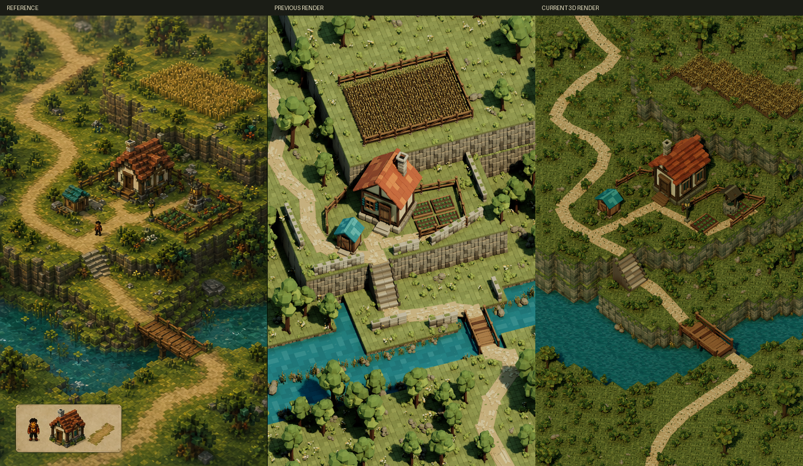

# Fidelity composition revision: progress, not pixel parity

The subsequent [asset detail update](Details/review.md) contains the current render and comparison. The images and measurements below retain the historical broad pass-5 results.

The current 3D scene is `/Game/Terrarium/Maps/HomesteadFidelity`. This revision addresses the request for a much closer reference match and more detailed original geometry. The exact pixel-parity goal remains **unachieved**.

[Native 1443 x 2427 render](pass-5.png) / [Pixel comparison metrics](comparison-metrics.json) / [Saved-editor validation](editor-validation.json)

## Concrete improvements

- Replaced the rectangular terrain composition with reference-traced plateau, path, and shoreline boundaries. Ground-contact landmarks use an invertible orthographic projection at 481 x 809 reference pixels.
- Deepened the cliffs and connected the lower terrace to the land behind it.
- Rebuilt the cottage with a narrower gable, recessed side windows, individual joinery, stepped clay roof blocks, a relocated layered chimney, and additional foundation stones.
- Replaced uniform ground squares with irregular moss facets, enlarged exposed cliff stones, added smaller branching trees and detailed shrubs, and changed the water to a fine irregular triangular mosaic.
- Added original garden-well and lantern-post meshes. Made the wheat field more continuous and moved the bridge/stair connection toward reference landmarks.
- Adjusted the palette and fixed exposure. Corrected Lumen's cached-lighting pre-exposure range using UE 5.8's documented value 8, so effective exposure EV 12.65 is within its valid range.

## Pixel evidence

Both renders were resized to the reference's 481 x 809 dimensions without warping or registration. Average absolute RGB channel error on the 0-255 scale:

| Region | Previous render | Current render |
| --- | ---: | ---: |
| Full image | 53.94 | 28.67 |
| Cottage region | 62.47 | 29.21 |
| Wheat region | 43.39 | 27.76 |
| River and bridge region | 53.53 | 25.26 |
| Terrain and path region | 61.17 | 28.64 |

The full-frame error is about 47% lower. This is not a percentage of visual fidelity: RGB error is a limited image-distance measure, and darker colors alone can improve it. Direct visual comparison still shows substantial differences. The full-frame measurement includes the reference characters and lower-left inset, which remain omitted under the environment-only scope pending clarification.

## Validation and remaining work

Every added or revised mesh was baked inside Unreal with closed-solid and saved-normal checks, then inspected from six Lit angles before use. The cottage reached its third artistic refinement; the other revised meshes are at their second. The new well and lantern are at their first. The active scene uses native static mesh instancing for dense terrain and planting, with no runtime generation or gameplay systems.

The saved scene was reloaded and its actual static mesh and instanced mesh references were counted against the placement manifest. Materials remain single-sided. Live Lumen settings and the valid fixed-exposure cache range were checked separately from the pixel comparison.

The main remaining differences are the exact terrain contours, distribution and scale of vegetation, cottage dormer-like roof projections and weathering, the garden structure's silhouette, path width/edge softness, water color variation and shore detail, and the reference's painterly shading and texture. These are visible mismatches, not completed requirements.

This revision uses broad scene passes 4 and 5 of the original five-pass cap. Further broad revisions require resolving that cap with the user. The earlier `Homestead` map and the pass-4 scene snapshot `HomesteadFidelityPass4` remain available for comparison. The active fidelity goal has not been marked complete.
