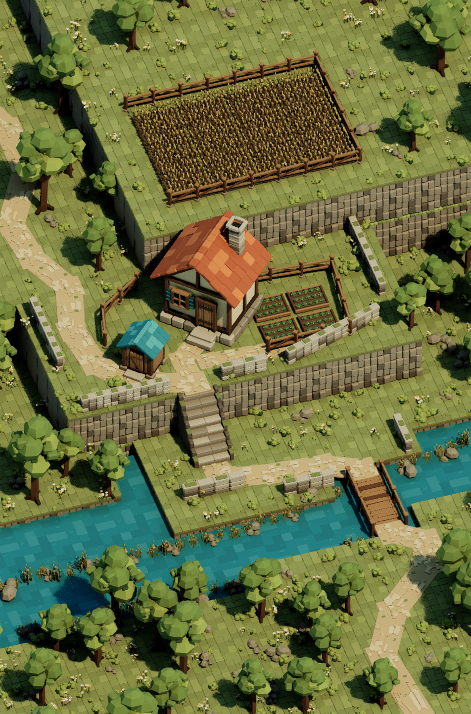

# Completed homestead environment

The original static environment is complete in `/Game/Terrarium/Maps/Homestead`. The user authorized proceeding through all remaining phases, superseding the checkpoint pauses in the original objective.

This 1584 x 2400 image was rendered directly in Unreal Engine 5.8.2, without external image synthesis or compositing. The saved level remains editable and supports editor free-fly review.

## Delivered scene

- Raised grassy plateau with moss-capped stone strata and a low perimeter wall.
- Terracotta-roof cottage with chimney, timber framing, shutters, and entrance steps.
- Smaller teal-roof shed beside the winding approach.
- Four planted kitchen-garden beds enclosed by wooden fencing.
- Twelve wheat patches on the higher terrace, with a field fence.
- Dirt paths joining the cottage, eight-step stone descent, lower landing, and plank bridge.
- Continuous teal river with modeled ripples, reeds, and mossy river stones.
- Orchard trees, bushes, cream and gold wildflowers, and rock clusters.

All 18 meshes were custom modeled with Geometry Script. The final scene contains 3,430 mesh placements and three original matte palette materials. No marketplace assets were used.

## Validation

Every original mesh passed closed-component, outward winding, and saved StaticMesh normal checks, followed by six Lit views under the baseline Lumen rig. All reports record zero saved normal errors. All meshes remain at artistic refinement pass 1, within the three-pass limit.

The complete scene was inspected from its hero camera, a [lower side view](side-view.png), and an [overhead view](overhead.png). These views checked building grounding, the staircase connection, garden placement, the river crossing, and visible terrain continuity.

The final map was saved, unloaded, reopened, and validated in the editor. All 3,430 placements survived; all 18 mesh references and all material references loaded. Materials are single-sided; scales are finite and positive. Live rendering variables confirmed Lumen GI, Lumen reflections, mesh distance fields, and virtual shadow maps. Exposure is manual EV100 12 with zero compensation.

The saved camera is orthographic, 27.8 m wide, pitch -45 degrees, yaw 153 degrees, aspect 0.66. The warm directional light uses 18,000 lux with a 14-degree source angle, sky intensity 6.0, and increased Lumen gather quality. See [validation.json](validation.json) for editor measurements.

## Whole-scene passes

Three of the permitted five broad visual passes were used:

1. Corrected stair orientation and planting heights, adjusted cottage scale, softened frontal illumination, and tested oblique framing.
2. Aligned the rising terraces with the reference view, extended surrounding land, retained unstretched cliff courses, cleared obstructing trees, and added reviewed meadow and river details.
3. Reduced grass and water color contrast, widened the portrait to include the bridge, and slightly increased ambient fill.

Per-pass captures and separate settings records are retained in `Docs/Phase3`. This interpretation has more regular modular terrain edges and simpler foliage than the painterly reference. The river is opaque, matte, and static. Small stochastic shadow grain remains visible at close magnification.

No character, gameplay, interaction, inventory, dialogue, UI, or runtime generation was added. Gameplay collision, packaged builds, and performance targets were not tested for this static editor milestone.
