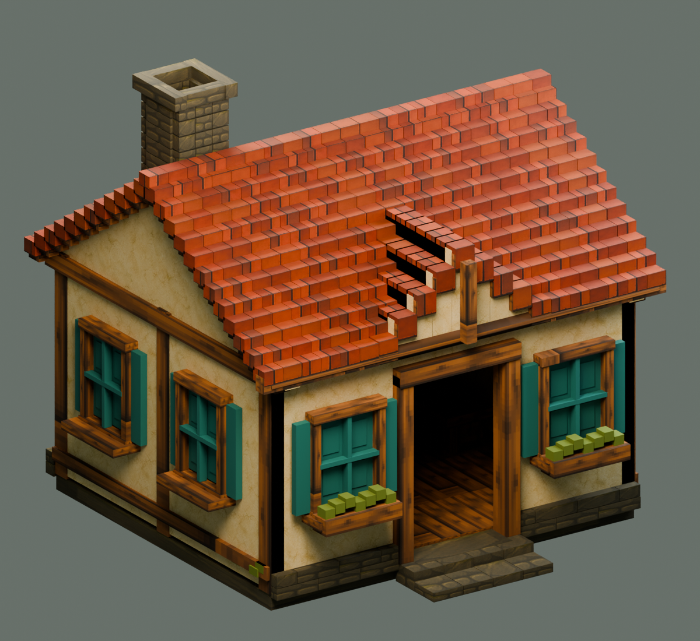
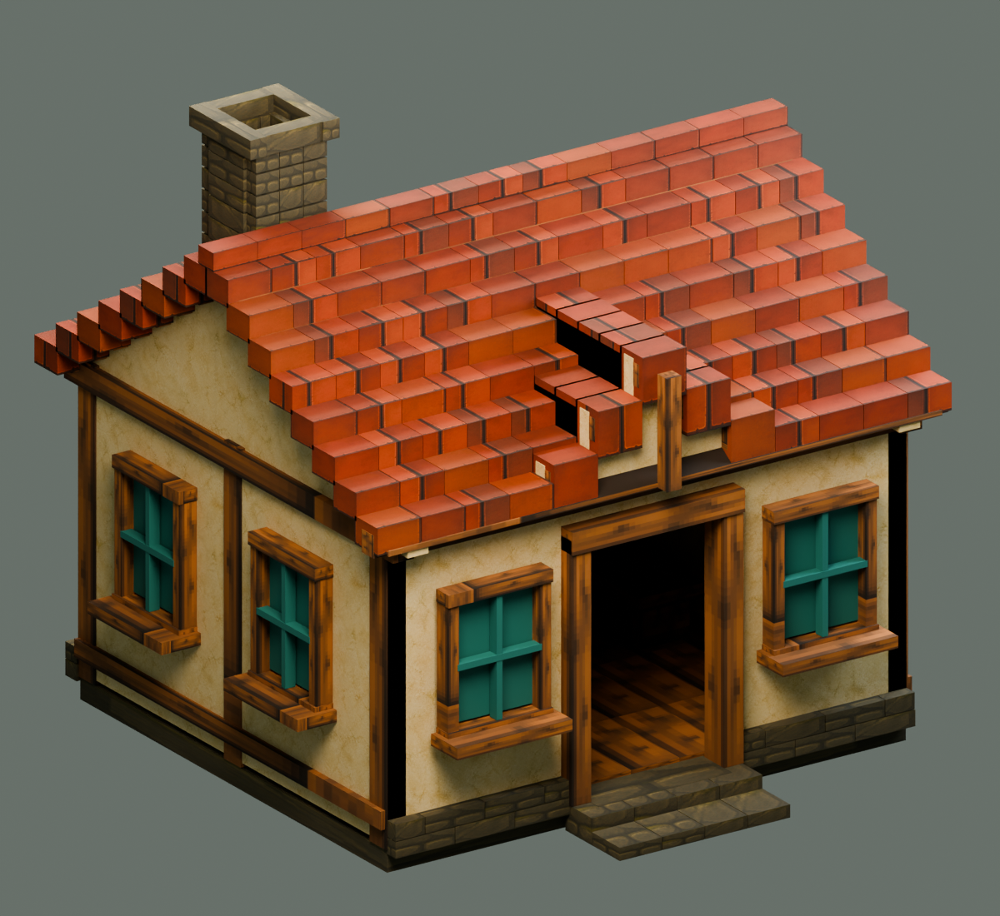

# Cottage roof repair V2

The authored cottage LOD1 and LOD2 now use deeper roof tiles and lower gable infill. This closes the gaps caused by thin horizontal tiles on coarse roof steps. The steeper front cross-gable has its own tile depth allowance. Tile top vertices, ridge dimensions, overall bounds, materials, UVs and triangle counts are preserved.

Use the original `SM_HP_Cottage_LOD0.fbx` for LOD0 and the two repaired files below for LOD1 and LOD2. Do not use the original coarse cottage exports or automatic reductions for this repaired chain.

| Level | Export | Triangles |
| --- | --- | ---: |
| LOD0 | `SourceAssets/Blender/HomesteadPilot/Architecture/SM_HP_Cottage_LOD0.fbx` | 43,496 |
| LOD1 | `SourceAssets/Blender/HomesteadPilot/Architecture/RoofRepairV2/SM_HP_Cottage_RoofV2_LOD1.fbx` | 12,516 |
| LOD2 | `SourceAssets/Blender/HomesteadPilot/Architecture/RoofRepairV2/SM_HP_Cottage_RoofV2_LOD2.fbx` | 6,876 |

The normal editable source is `SourceAssets/Blender/HomesteadPilot/Architecture/RoofRepairV2/HomesteadArchitecture_RoofV2.blend`. The original source and exports remain intact. The repair is reproduced by the scoped `repair_roof_v2.py`, `package_roof_v2.py` and `verify_roof_v2.py` scripts under `Scripts/HomesteadPilot/Architecture`.

Import with the existing eight materials in their unchanged slot order. Units remain metres, Z up, front −Y, with the original base-centre origin. Each level measures approximately **5.76 × 5.76 × 5.395 m**, including steps, eaves and chimney. These are approximately **576 × 576 × 539.5 cm** after Unreal import.

Fresh source reopen and both FBX roundtrips passed: dimensions, UV presence and all eight slots. The original source hash and LOD0 geometry/UV fingerprint match the pre-repair values. See [manifest](manifest.json) and [verification receipt](verification.json) for exact values. The source checks do not assert Unreal transition quality; the integration receipts and final native captures cover that review.

