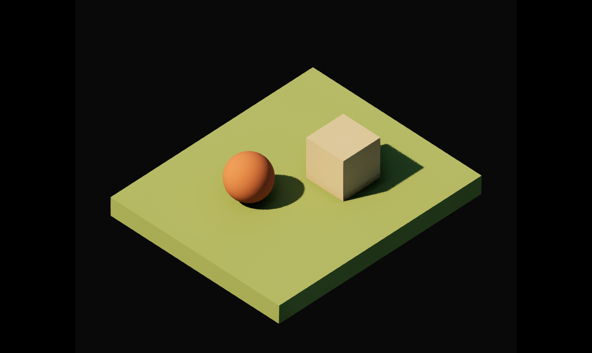

# Phase 0 — render baseline

Status: ready for user review. Stop here before Phase 1.

The saved map is `/Game/Terrarium/Maps/RenderBaseline`. The editor is left piloting `Baseline_Orthographic_Review` in Lit mode. Eject from the camera to explore with the editor viewport; no player or gameplay was added.

## Saved setup

- Orthographic CameraActor, pitch −40°, yaw 135°, width 1,850 cm.
- Lumen global illumination and reflections, mesh distance fields, D3D12/SM6, virtual shadow maps. Live values were verified after restarting the editor.
- Movable warm directional light (30,000 lux, 6° source angle), Sky Atmosphere, and movable Sky Light.
- Unbound Post Process Volume with Manual exposure, physical exposure enabled: ISO 100, f/8, shutter 1/64 s. This fixes EV100 at 12; compensation is 0.
- Three temporary engine primitives: olive ground slab, tan cube, terracotta sphere. The three matte materials were authored here. These are Phase 0 test shapes, not the original custom meshes required for Phase 1.

## Actual validation

Verified the connected editor project path and Unreal version 5.8.2 before authoring. All `.umap` and `.uasset` creation and saving ran inside Unreal through the bundled MCP editor tools and its Python console. MCP requests were sequential.

Inspected Lit viewport captures from the review angle and the opposite angle. Visible geometry remained solid, with colored shaded faces, curved-surface shading, and attached cast shadows; no missing faces or fully black objects were observed. The initial missing-distance-field warning cleared after the restart. See [reverse view](baseline-reverse.png).

Compared three stationary 1,526 × 910 captures separated in time. Mean absolute RGB changes were approximately 0.17/0.27/0.28 and 0.13/0.22/0.21 on the 0–255 scale. These samples showed small stochastic shadow changes, not large lighting jumps. Fine grain remains around soft shadows; this is a bounded capture check, not a claim of zero temporal variation or a long-duration video test.

The machine uses an AMD Radeon RX 6950 XT. Unreal warned that its installed driver is older than the recommended version. The editor was started with `-unattended` to avoid the startup dialog, with normal GPU rendering enabled. No driver or global configuration was changed.

Calling Unreal's `editor_set_viewport_realtime(True)` initially produced a handled missing-override ensure. That unnecessary call was removed from the retained scripts; the editor continued rendering and completed all captures. Generated `Saved`, `Intermediate`, `DerivedDataCache`, and `Binaries` paths remain ignored.

Machine-readable evidence: [renderer and exposure](validation.json), [temporal comparison](temporal-comparison.json), [capture pose](baseline-review.json).

## Checkpoint and next work

The objective explicitly says to capture Phase 0 and stop for review. Phase 1 has not started. After review, create each original modular asset separately using Unreal Geometry Script/static mesh tools, verify winding and normals in actual Lumen lighting per asset, and respect the three-refinement-pass limit. Stop again after Phase 1 before scene composition. Final broad lighting refinement is reserved for Phase 3 and capped at five passes.
