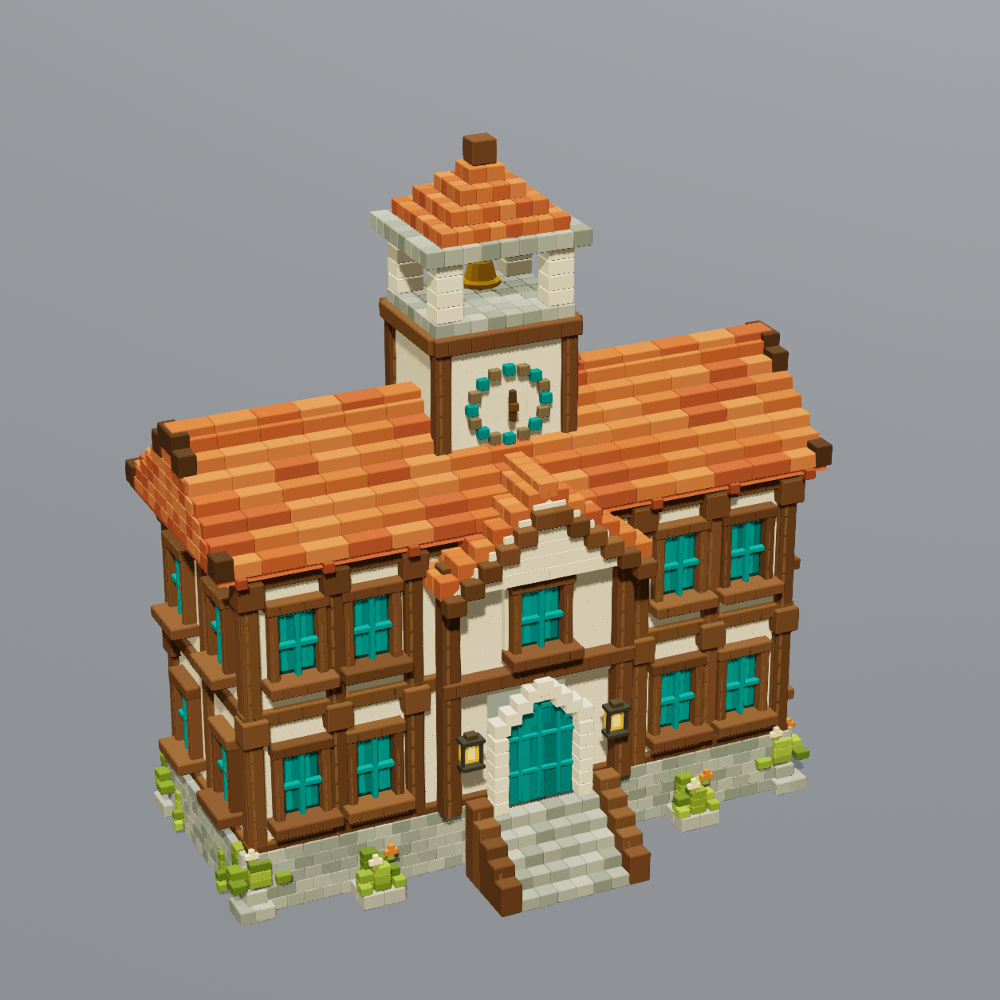
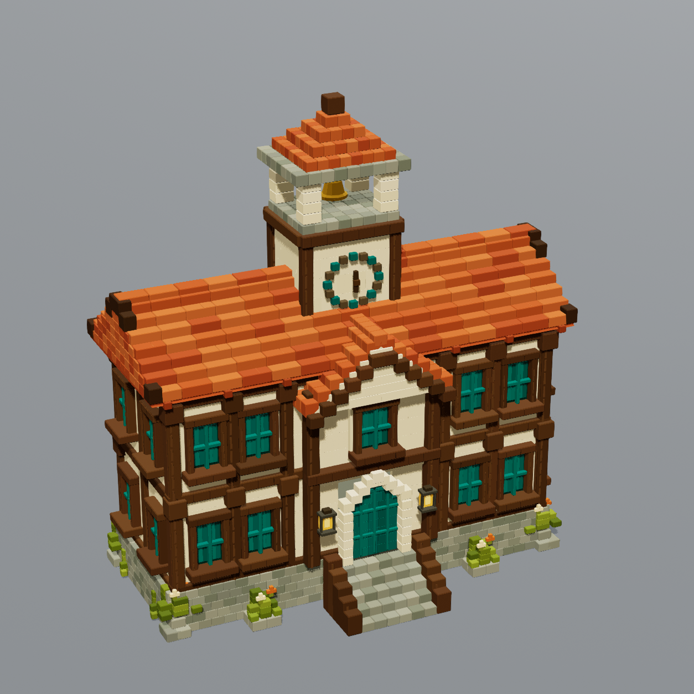
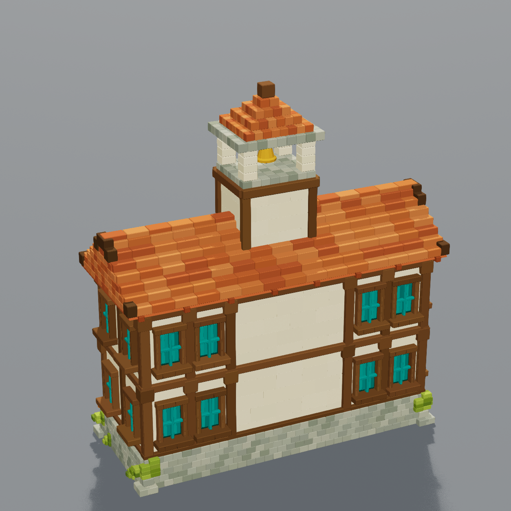
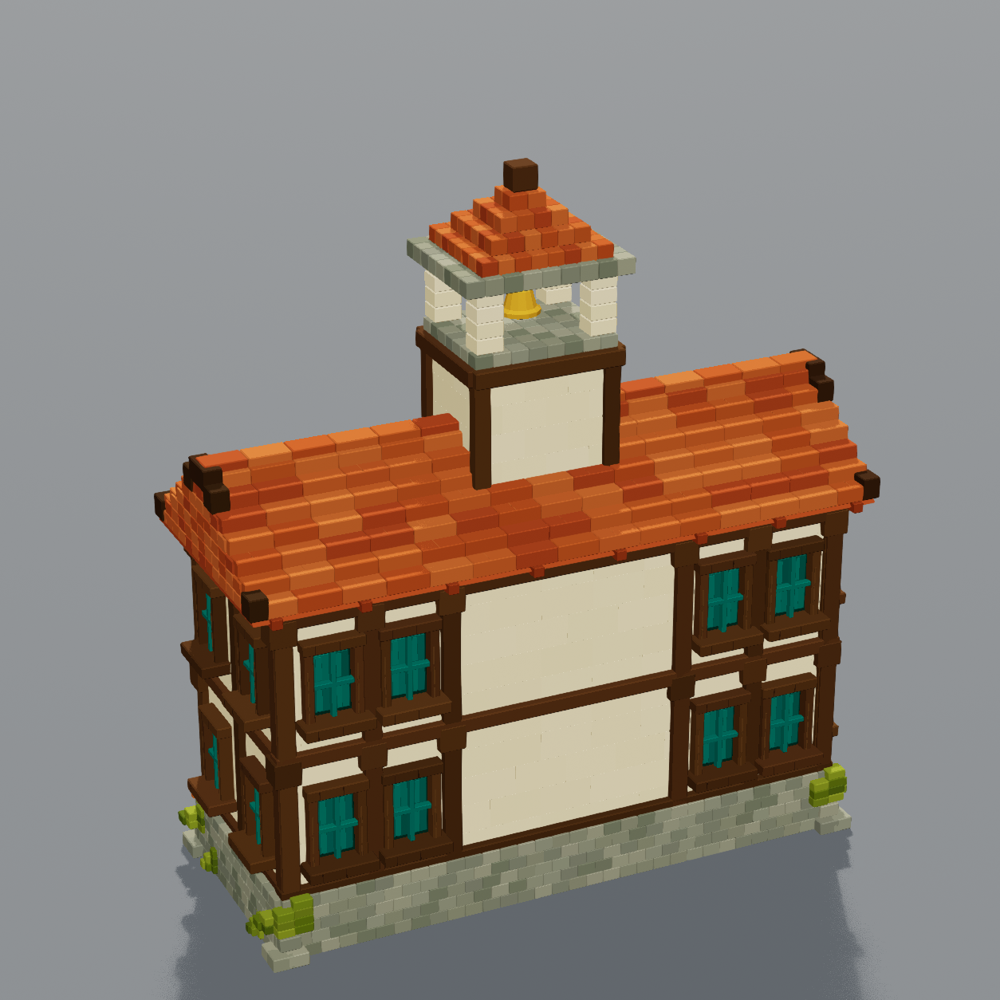

# Civic hall warm palette — revision 4

The civic hall now uses a dedicated material with richer red terracotta, darker
chestnut timber, warm ivory plaster, darker limestone, olive moss, and deeper teal
windows and door. The brass bell and amber accents retain their original colors.

The source concept is [civic_hall.png](../../SourceAssets/Voxel/civic_hall.png).
Open the [catalog](catalog.html) to compare it with the current front and back.

## Native comparison

| Earlier material, captured this session | Warm material, same camera and lighting |
|---|---|
|  |  |
|  |  |

These are native Unreal Lit renders at 1254 × 1254, using the saved ReviewStage
lighting, a 20-degree perspective field of view, pitch -24, and yaw 115/295.
The editor yielded frames between captures for material and scene updates.
No image recoloring or studio lighting changes were used.

## Validation

- Terrarium was verified through the project-local Unreal MCP connection before edits.
- R4 is an editor-created duplicate of R3 with one dedicated material assignment.
- Saved triangle positions and original vertex colors have identical SHA-256 hashes.
- The saved mesh has 150,672 triangles and zero normal alignment errors.
- The Architecture gallery was saved and reopened. Its civic hall uses R4;
  its transform and bounds and the other six mesh bindings remain unchanged.
- The front and back renders were visually inspected. The palette is warmer and
  less washed out, with a stronger separation between cream walls and dark timber.

See [editor verification](civic-hall-color-verification.json) and
[capture settings](Renders/CivicHall-R4-capture.json).

The original R3 mesh, material, receipt, and original comparison images remain
available. Exact concept parity and user acceptance are not claimed; the existing
geometric detail and lighting differences remain. Gameplay was not tested for
this material-only change.

The reproducible material recipe is
`Scripts/Reconstruction/civic_hall_color.py`; capture with
`Scripts/Reconstruction/capture_civic_hall.py` and validate/integrate with
`Scripts/Reconstruction/update_civic_hall_gallery.py` through the editor runner.
