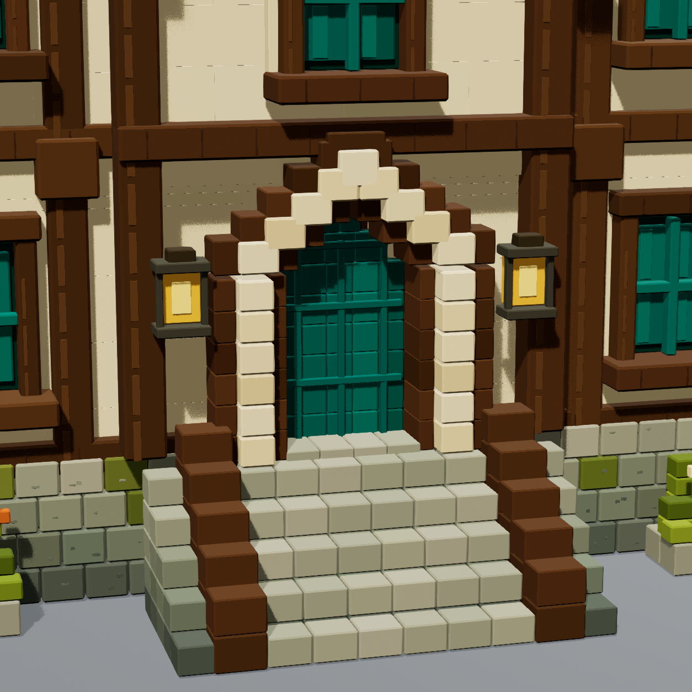
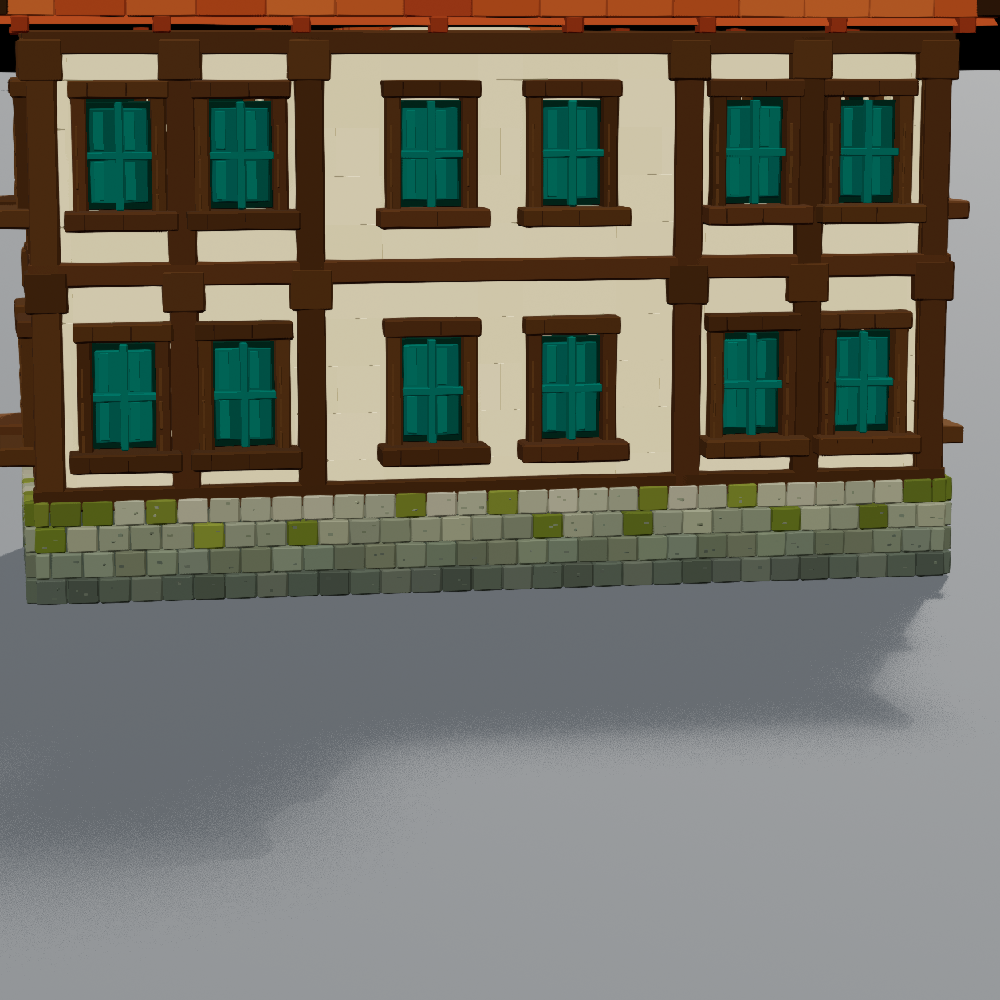

# Civic hall entrance and foundation — revision 7

This pass addresses the four entrance/foundation comments while retaining the
warm material palette and the four central rear windows from the preceding pass.

## Entrance

- Added coursed stone cheeks outside both stepped timber stair rails. Each stone
  cheek projects 21.5 cm beyond the wood before the hall's existing 1.1 X scale.
- Added a continuous outer stepped wood frame around the sandstone arch and an
  inner wood reveal, with 40 cm depth.
- Recessed the teal door face 53 cm behind the front of the sandstone arch. A
  stone threshold bridges the recessed leaf and the upper landing.

## Foundation on all four sides

- Four individually modeled, staggered stone courses become lighter toward the
  top, starting with dark gray-green stones at ground level.
- Stone colors vary within every course. Beveled joints and irregular small
  mineral marks provide surface detail on the front, back and both ends.
- Moss is integrated into the upper stone courses. Its vertices stay within the
  foundation envelope; the old protruding corner/side growth clusters were
  removed. The two separate flower planters remain.
- The rear has 122 stone blocks with the same treatment as the front. Each end
  has 50 blocks; no rear face is replaced by a flat panel.

## Verification

The saved mesh was checked in the verified Terrarium editor through project-local
Unreal MCP. Geometry Script validated closed components, outward normals and the
saved mesh round trip. The recipe comparison confirms unchanged geometry/colors
outside the entrance and foundation, including the upper building and rear
windows. The dedicated warm R4 material remains assigned.

Front, back, entrance and rear-stone images are native Unreal Lit captures at
1254 × 1254 with the saved studio lighting. No image recoloring was used. All four
were visually inspected. R6 was an intermediate candidate; R7 closes the small
gaps found in the stepped wooden arch during close-up review.

The Architecture gallery was saved and reopened with R7. Placement is unchanged;
the new stair outline shortens the overall front bound by 0.5 cm. The other six
gallery mesh bindings remain unchanged.

See the [verification report](civic-hall-entrance-verification.json),
[saved mesh checks](../Phase1/Validation/SM_Recon_CivicHall_R7.json),
[capture settings](Renders/CivicHall-R7-capture.json), and [catalog](catalog.html).
User visual acceptance is pending. Gameplay and collision were not tested.

The local detail recipe is `Scripts/Reconstruction/civic_hall_details.py`.
Build it through `Scripts/Reconstruction/build_civic_hall_details.py`, then run
`capture_civic_hall.py` and `update_civic_hall_gallery.py` through the editor runner.
