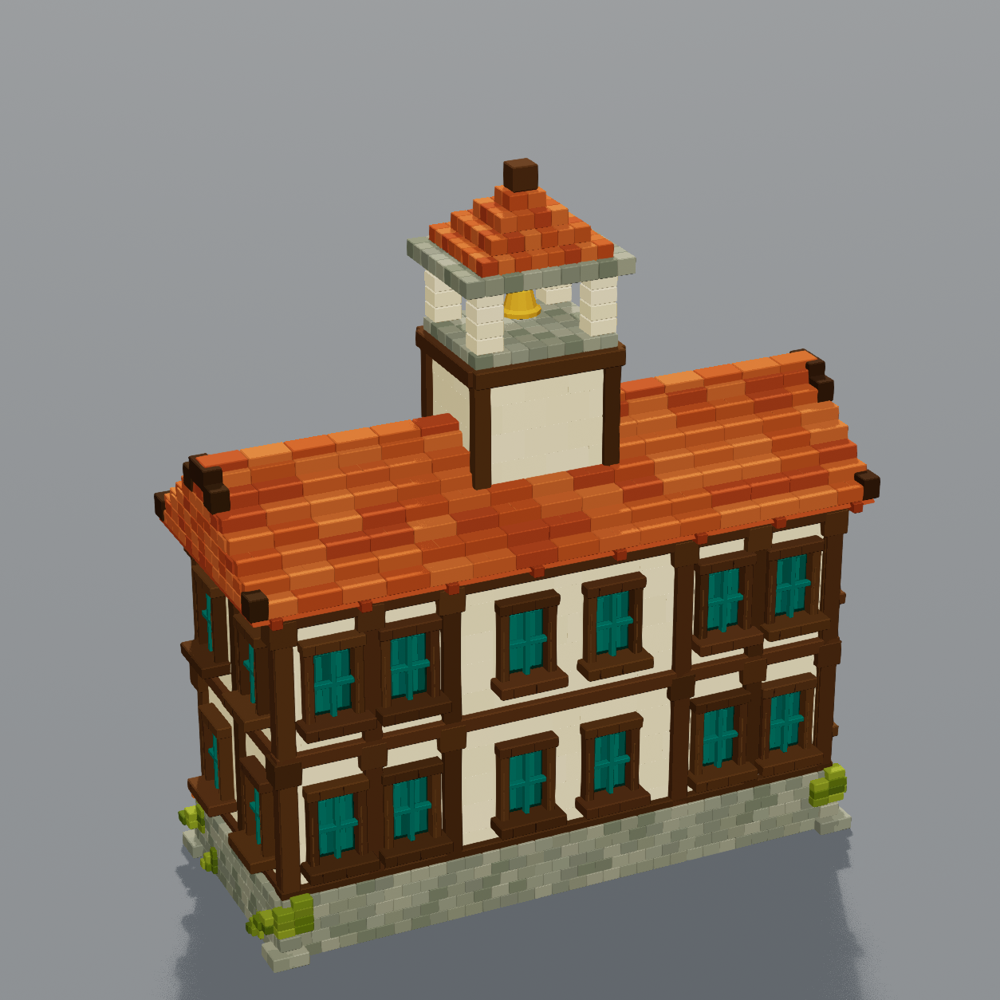

# Civic hall rear center windows — revision 5

Added two matching windows to the center of each rear floor: four new windows in
total. They align with the existing window heights and use the same recessed teal
panes, mullions, timber jambs and projecting sills. The plaster panels are built
around the openings. R4's dedicated warm material remains assigned.

The [catalog](catalog.html) now selects R5 and includes fresh front/back native
Unreal renders. The original R4 remains available for comparison.

## Validation

- Confirmed the connected editor was Terrarium through project-local Unreal MCP.
- Compared old/new recipe triangle positions and vertex colors outside the rear
  facade; they are unchanged, including the front, roof, tower and plants.
- Validated the saved mesh: 155,952 triangles, closed components, outward normals,
  zero saved normal alignment errors.
- Inspected both native Lit renders; all four new rear windows are visible and
  the front retains its existing appearance.
- Saved and reopened the Architecture gallery with the R5 civic hall. Verified
  its material, unchanged placement/bounds, and the other six mesh bindings.

See [editor verification](civic-hall-windows-verification.json),
[mesh validation](../Phase1/Validation/SM_Recon_CivicHall_R5.json), and
[capture settings](Renders/CivicHall-R5-capture.json). Gameplay and collision
were not tested for this static geometry change. User visual acceptance is pending.

Build through `Scripts/Reconstruction/build_civic_hall_windows.py`, capture with
`Scripts/Reconstruction/capture_civic_hall.py`, and update the gallery with
`Scripts/Reconstruction/update_civic_hall_gallery.py`, all through the verified
editor runner. The base architecture recipe defaults to the new rear windows.
