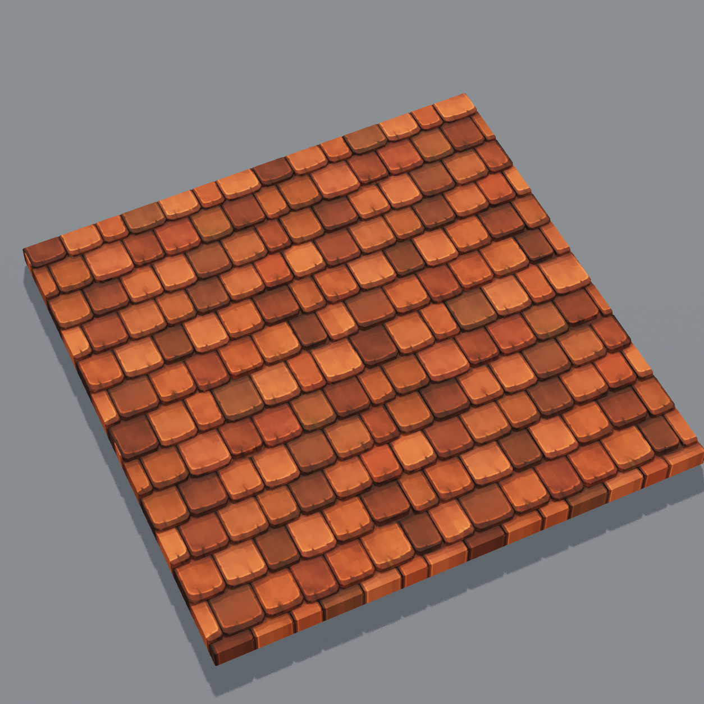
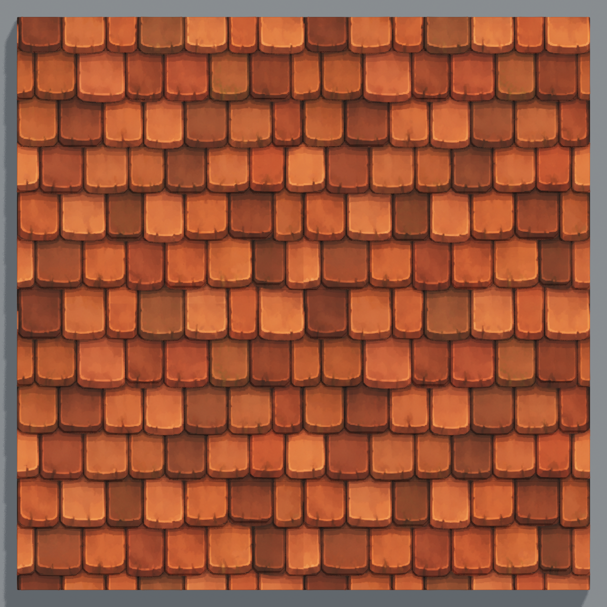

# Cottage roof tile R2

The old surface used a 20 by 20 cube grid with a height reset every third grid row. Those geometry edges cut across the painted tiles and introduced the repeated horizontal bands identified in review.

R2 replaces that grid with 188 individual shallow tile shapes, including partial tiles at the boundary. Tile widths, staggered seams, and lower edges follow measurements from the original image. Soft lower corners and slight variations in the raised tile feet support the painted shapes without adding large ridges across the surface.

The original PNG, imported source texture, material, and full-surface UV mapping are preserved. The relief adds approximately 0.4 cm of rise to each tile; the existing source shading remains part of the texture.

Validation in the connected Terrarium editor:

- Saved mesh: `/Game/Terrarium/Reconstruction/Meshes/SM_Recon_cottage_roof_tile_v5_R2`.
- 8,316 triangles; zero saved normal errors; 189 closed components (188 tiles and one supporting slab).
- Native front, back, and top renders inspected.
- Surfaces gallery saved and reopened with R2 selected, 45 models present, and the other 44 model meshes, materials, and transforms verified unchanged.
- Roof placement retained with zero ground error; original PNG hash and material texture binding verified.

Evidence: [build receipt](Builds/SM_Recon_cottage_roof_tile_v5_R2.json), [source layout](roof-tile-layout.json), and [editor verification](roof-tile-verification.json). Visual acceptance is pending user review; gameplay was not tested for this surface revision.
