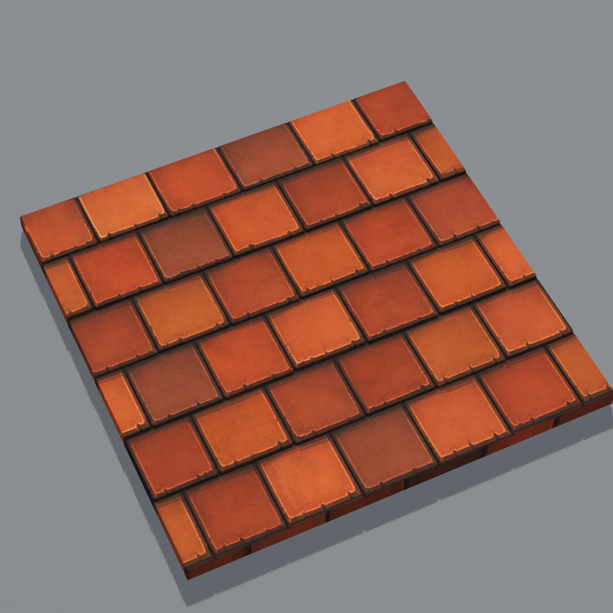
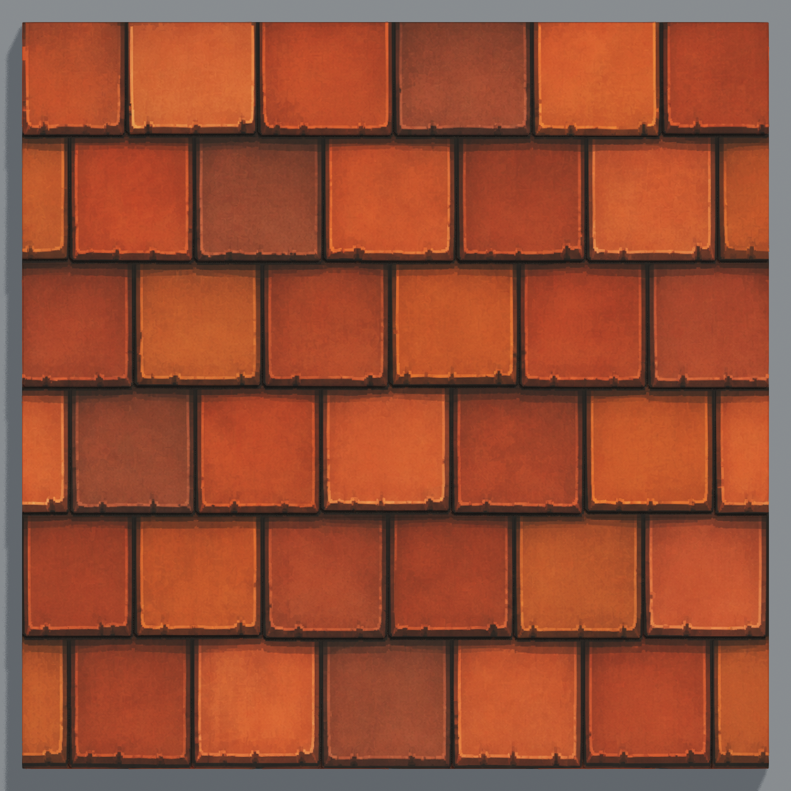

# Cottage roof tile v6 candidate R2

The R1 reconstruction applied a 20 by 20 cube grid and a height reset every third grid row to the original texture. That grid cut new lines across the large painted tile faces.

R2 uses 39 individual tile shapes across the source's six staggered rows, including cropped tiles at the edges. Seam positions and tile feet are measured from the v6 candidate image. Its mostly square corners receive small clipped corners, and each tile has shallow relief rather than the old repeated ridges. The v5 tile layout is not reused for this larger pattern.

The source PNG, original imported texture and material, and full-surface UV mapping are preserved.

Build validation: 1,760 triangles, zero saved normal errors, and 40 closed components (39 tiles plus the supporting slab). Native front, back, and top captures support visual review.

The gallery verification checks the saved and reopened Surfaces map, all 45 model entries, preservation of the other 44 meshes/materials/transforms, roof grounding, and the original source texture binding. See the [editor verification](roof-tile-v6-verification.json), [build receipt](Builds/SM_Recon_cottage_roof_tile_v6_candidate_R2.json), and [source layout](roof-tile-v6-layout.json).

Visual acceptance is pending user review. Gameplay was not tested for this surface revision.
