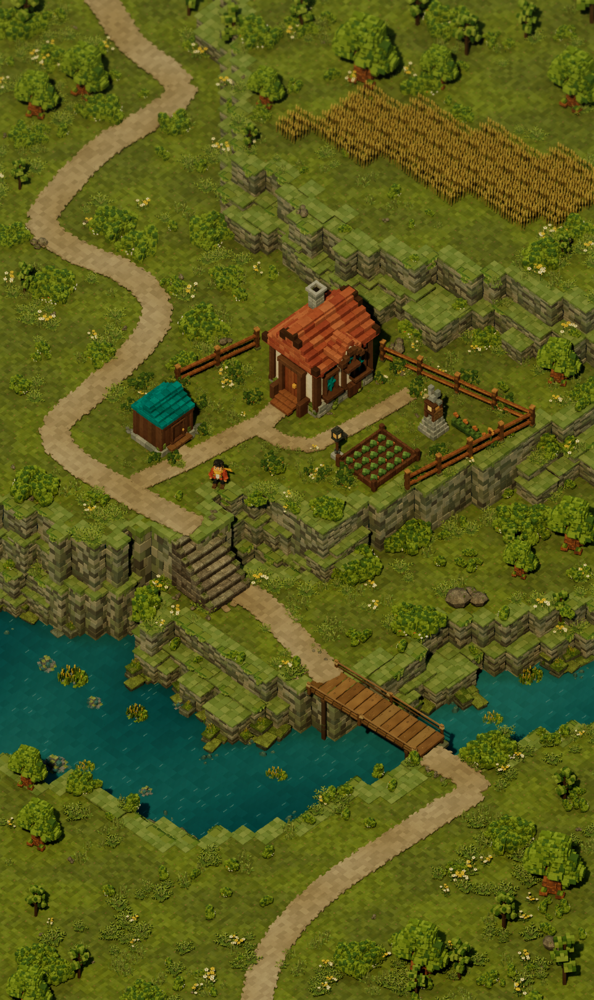

# Terrarium

The reconstructed voxel library is available in the [source/model comparison catalog](Docs/Reconstruction/catalog.html): 77 original images mapped to 72 static meshes, with front/back renders and five Unreal galleries. See the [library guide](Docs/Reconstruction/README.md) and [visual review](Docs/Reconstruction/visual-review.md) for validated coverage and remaining differences.

A quiet homestead above a teal river: terracotta cottage, garden beds, a wheat terrace, and a winding stone stair approach. An original static environment built in Unreal Engine 5.8.2.



The current environment is `/Game/Terrarium/Maps/HomesteadReference`, also the startup/default map. It assembles the rebuilt explorer and courtyard pieces with the raised wheat field, winding paths, voxel cliffs, trees, river and timber crossing from the supplied reference. See the [reference comparison](Docs/Environment/comparison.html), [environment guide](Docs/Environment/README.md) and [native validation](Docs/Environment/verification.json). Exact artistic parity is not claimed.

Open **Terrarium.uproject** or run `Scripts/Open-Editor.ps1`. The saved orthographic review camera frames the portrait; stop piloting it to explore with the editor viewport. Earlier `Homestead` and `HomesteadFidelity` levels remain available for comparison.

[Full-resolution image](Docs/Final/homestead.png) / [Review notes](Docs/Final/review.md) / [Editor validation](Docs/Final/validation.json)

The earlier 18-mesh milestone used separate Geometry Script recipes in `Scripts/Assets` and placement sources in `Scripts/Scene`. Current reconstruction and environment recipes are in `Scripts/Reconstruction`. The scene uses a fixed-exposure Lumen lighting rig and a static explorer model; it contains no gameplay systems, interactions, or UI.

The approved render baseline remains in `/Game/Terrarium/Maps/RenderBaseline`; the initial 15-piece kit remains in `/Game/Terrarium/Maps/ModularGallery`. The final scene adds original rocks, wildflowers, and reeds.

## Editor review

To restore the saved portrait view through the local MCP console:

```powershell
python Scripts/unreal_mcp.py init
python Scripts/unreal_mcp.py list
python Scripts/run_editor.py Scripts/Reconstruction/open_environment.py
```

Use **Lit** viewport shading. `Scripts/Reconstruction/capture_environment.py` produces native 962 x 1618 reference views; its request file is `Saved/environment-capture.json`. `Scripts/Reconstruction/verify_environment.py` saves, reopens, and validates the current map. Run these inside the editor through `Scripts/run_editor.py`.

## Project-local Unreal MCP

Epic's bundled ModelContextProtocol and AllToolsets plugins provide the editor tools. Configuration is scoped to `.codex/config.toml`, with the editor server at `http://127.0.0.1:8000/mcp`. Use one connected editor on this port, discover toolsets first, and call tools sequentially. The runner verifies the Terrarium editor before executing scripts.

`Binaries`, `Intermediate`, `Saved`, and `DerivedDataCache` remain excluded from source control. The finished environment was validated in the interactive D3D12/SM6 editor. Gameplay, collision tuning, packaging, and performance optimization are outside this milestone.
